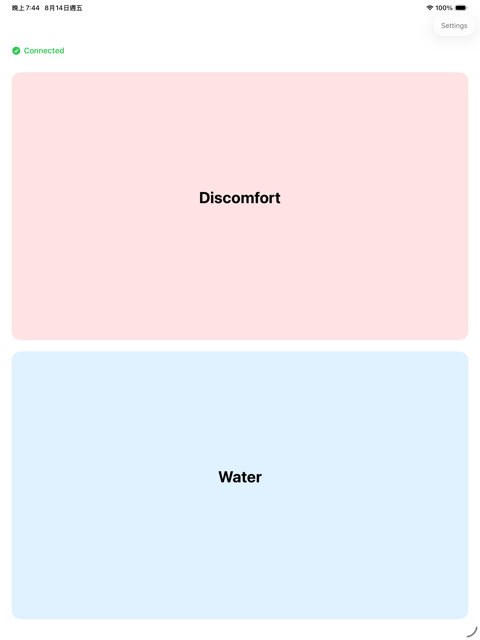
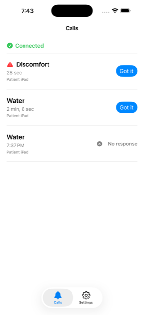

<div align="center">

# SideBell · 隨身鈴

**An accessible call bell that works without the internet.**

[](https://developer.apple.com/ios/)
[](https://swift.org)
[](Tests/)

</div>

---

Someone who cannot speak or move easily presses a button. Their caregiver's
phone raises an alarm, says out loud what is needed, and keeps repeating until
someone responds. No internet. No account. No subscription.

Built for people with ALS, severe motor impairment, or anyone recovering in bed
— and for the person taking care of them.

**▶︎ [Watch it work](https://youtu.be/cQijN-efZqE)** (43s, two devices, no cuts)

<table>
<tr>
<td align="center" valign="top">

<br><sub><b>Patient side</b> — beside the bed.<br>Large targets, one tap, no gestures.</sub>
</td>
<td align="center" valign="top">

<br><sub><b>Caregiver side</b> — in their pocket.<br>Every call carries its own state.</sub>
</td>
</tr>
</table>

## Why it exists

A call bell beside the bed only helps if the caregiver is within earshot. A
phone app only helps if it works when the Wi-Fi is down, when the caregiver is
in another room, and when nobody remembered to keep the app open.

SideBell is two devices talking directly over Bluetooth. The patient's tablet
stays beside them; the caregiver carries their phone. Nothing passes through a
server, so nothing breaks when the network does.

**After tapping, the patient sees whether the call was delivered and whether it
was acknowledged.** They never have to wonder if their call for help was heard —
which, for someone who cannot ask again, is the whole point.

## How it works

| | |
|---|---|
| **Transport** | Bluetooth LE. Patient = peripheral, caregiver = central. No server, ever. |
| **Alerts** | Not silenced by the ring switch. Urgent calls repeat until acknowledged or until three minutes pass. |
| **Background** | Survives the app being suspended *or* terminated — CoreBluetooth state restoration wakes it to deliver the call. |
| **Accessibility** | Full VoiceOver and Switch Control. Single-tap targets only, so the system's Eye Tracking and Dwell Control can drive it directly. |
| **Storage** | SwiftData, on-device only. Nothing leaves the devices. |

### Every feature is free

There is a "Support the developer" option on the caregiver side. It unlocks
nothing — there is no entitlement check anywhere in the codebase, and the
patient side has no purchase UI, no prices, and no way to spend money at all.

## ⚠️ Important

SideBell is a **care assistance calling tool**. It cannot replace emergency
medical alert services. In an emergency, call your local emergency number.

It works over Bluetooth, so its range is limited; it cannot send calls when the
app is closed or the device runs out of battery. Test it together with the
person you care for, in the places you will actually use it, before relying on
it.

## Building

Requires Xcode 26+, iOS 18 deployment target, and
[XcodeGen](https://github.com/yonaskolb/XcodeGen) (`brew install xcodegen`).

```bash
git clone https://github.com/shinrenpan/SideBell.git
cd SideBell
cp Config/Secrets.example.xcconfig Config/Secrets.xcconfig
xcodegen generate
open SideBell.xcodeproj
```

`.xcodeproj` is generated and not tracked — **`project.yml` is the source of
truth.** Editing build settings in Xcode will be overwritten on the next
`xcodegen generate`.

The app builds and runs without a RevenueCat key; only the support screen is
affected. Calls and alerts have no dependency on it.

> **Two devices are required to see it work.** Bluetooth is unavailable in the
> Simulator, so a single device will always show "Not connected" — that is the
> Simulator's limitation, not a bug. Run `./scripts/screenshots.sh` if you want
> to see the screens with simulated data.

## Repository layout

```
Sources/
  App/           AppDelegate, SceneDelegate, AppRouter
  Core/          Transport (BLE), Alert, Persistence, Notification, Sponsorship
  Features/      One folder per screen: View + ViewModel + HostController + Mocks
Tests/           107 tests, Swift Testing
openspec/
  specs/         12 capability specs — the source of truth for behaviour
  changes/       Change proposals; archive/ holds every completed one
docs/
  device-verification/  Per-feature manual test checklists with real results
  release-checklist.md  What to check before every submission
  roadmap.md            What comes after 1.0
  archive/              The pre-development spec, kept for provenance
DECISIONS.md     Cross-cutting decisions and what we learned the hard way
```

### Architecture

[**MVVMC**](https://github.com/shinrenpan/MVVMC) — four layers, one folder per
screen:

| | |
|---|---|
| **Models** | State, domain models, DTOs |
| **View** | Pure SwiftUI. No navigation, no business logic — it only sends actions |
| **ViewModel** | `@Observable @MainActor final class` with a single `doAction` entry point |
| **HostController** | The UIKit bridge. Navigation is its only job |

The transport layer sits behind a protocol, which is why the BLE implementation
can be swapped and why the screenshot tooling can stand in for it.

## Development

This project is spec-driven, managed with
[**Spectra**](https://github.com/kaochenlong/spectra-app). Behaviour is written into
`openspec/specs/` before it is built; every change leaves a proposal, a design
note, and a task list behind in `openspec/changes/archive/`. Twelve capability
specs and seven archived changes are the result.

It is also **AI-assisted** — the specs, most of the implementation, and the
verification checklists were produced in collaboration with Claude, working
inside that spec-driven loop. That is worth stating plainly rather than leaving
people to guess: nobody hand-writes 4,600 lines of specification alongside a
shipping app in nine days.

What matters is not the speed. It is that the loop **forces the failures into
the open**. Three defects found on the last day before submission — the alert
never arming after the system reclaimed the app, non-urgent calls losing their
spoken announcement, and a two-day-old misdiagnosis about a custom sound file —
were all caught because the process demands that every claim be re-tested and
every result written down, not because anything was written quickly.

Two things are worth reading if you want to understand *why* the code looks the
way it does:

- **`DECISIONS.md`** — the decisions that cost something to learn. Silent-switch
  behaviour, why the alert loop lives in the audio file rather than a timer, why
  a "✅ passed" checklist entry is not proof of anything.
- **`docs/device-verification/`** — every manual test, with the actual result
  and the OS version. Including the ones that failed.

## Roadmap

See [`docs/roadmap.md`](docs/roadmap.md). The short version: remote push as a
*complement* to Bluetooth (never a replacement), Indonesian and Vietnamese, and
an evaluation of one caregiver watching over several patients.

## Contributing

**You do not need to write Swift to help.** The most valuable contribution right
now is translation.

Strings live in `Sources/Resources/Localizable.xcstrings`. Indonesian and
Vietnamese are on the roadmap for a concrete reason: in home care in Taiwan, the
person actually operating the caregiver's phone is often a migrant care worker.
Reaching them costs little and changes a lot.

But the call items are **not a translation exercise**. "Discomfort" carries a
different weight in different languages, and how urgently someone would say it
depends on where they are. That needs lived knowledge of the setting, not a
dictionary. If you have that knowledge, you are exactly the person this project
needs.

Bug reports from real use are equally welcome — especially anything involving
background delivery, since that is the hardest part to get right and the easiest
to get wrong silently.

## License

[MIT](LICENSE). Take it, change it, ship your own — especially if it reaches
someone this one doesn't.

The name "SideBell", the app icon, and the App Store listing are not covered by
the license.

## Credits

Built by [Shinren Pan](https://github.com/shinrenpan) for RevenueCat Shipaton 2026.

Privacy policy: <https://shinrenpan.github.io/SideBell/privacy/>
